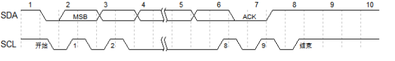
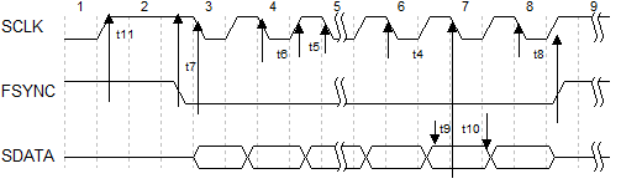
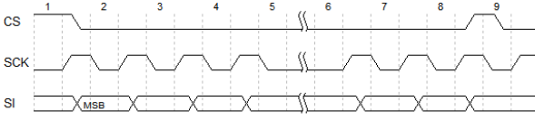

# 基于DDS的信号发生器
 ---
### 基本概述

本设计使用STC8H8K64U单片机通过IO端口控制波形发生器AD9833输出波形，经过低通滤波单元接入由MCP41010数字电位器控制的MS8051运放来将产生的信号幅值放大，并且配置了相应的按键输入和液晶屏显示波形的幅值、相位、频率等数据。

### 硬件设计

本设计中基于DDS的多功能信号发生器使用STC8H8K64U实验板通过IO端口控制波形发生器AD9833模块输出波形，经过一个低通滤波单元接入由MCP41010数字电位器控制的MS8051运放进行幅值放大，具体产生的波形、幅值、相位、频率等数据通过液晶屏显示出来，理想测定值通过按键进行人机交互，其中显示单元由12864的液晶模块组成，单片机通过IIC协议控制液晶屏的显示，整个系统通过USB提供电源，外加的接口进行信号的下载和输入。

##### 控制单元
STC8H8K64U具有16个口线，其中P1.4、P1.5、P1.6、P1.7四个口线连接AD9833进行控制主要波形的输出，P1.0、P1.1两个口线连接OLED液晶屏显示波形、幅值、相位、频率等数据信息，P3.4、P3.5、P3.6、P3.7四个口线连接四个按键，进行模式、选择、加和减的控制，P3.3一个口线连接开关进行设置的自锁功能控制，控制单元的电路原理图如下所示。

##### 信号发生模块

DDS的实现方式有两种，即通过程序实现和通过DDS芯片实现，通过程序实现需要DAC模块，通过DDS芯片实现需要AD9833模块，本组课程设计采用通过DDS芯片实现的方式。
在与STC8H8K64U实验板的连接传输过程中，SDATA引脚进行串行数据的输入，SCLK引脚进行串行时钟的输入，FSYNC引脚进行低有效控制的输入，最后通过VOUT引脚输出方波、正弦波、三角波等信号，AD9833信号发生模块的电路原理图如下所示。

##### 滤波放大模块

考虑到输出的波形可能不是理想的，所以对于AD9833输出的信号采用低通滤波单元进行滤波处理，降低高频噪声对整个系统电路的影响。

由于选用的信号发生器其中自带数字电位器进行阻值调节，所以初步方案的放大单元由MCP41010数字电位器和AD8051运算放大器构成，但在实际测试过程中，AD8051运放的增益带宽积过小，经查阅资料后把AD8051运放改成增益带宽积较大的MS8051运算放大器。

MCP41010数字电位器的CS引脚为数字电位器的片选端，只有为低电平时，命令字和数据字才能进入16位移位寄存器，滤波放大模块的电路原理图如图所示。

### 软件设计
本设计中使用Keil5编写C语言程序控制STC8H8K64U通过SPI协议与AD9833芯片进行通信输出波形，复用AD9833占用的SPI口线对MCP41010数字电位器进行控制来调整幅值。具体产生的波形、幅值、相位、频率等数据通过液晶屏显示出来，理想测定值通过按键进行人机交互，其中显示单元由12864的液晶模块组成，单片机通过IIC协议控制液晶屏的显示。程序流程图如下

#### 相关硬件驱动

##### OLED驱动

我们先对每一个部分进行代码实现，然后调用所实现的函数进行组合发送一个字节的数据。然后根据汉昇的数据手册分别发送命令（command）与数据（data）。我们可以通过发送命令对屏幕进行设置模式，清屏等操作。根据上述流程我们实现我们所需要使用的驱动函数，详细代码细节可见附录，IIC协议的控制流程图如图所示。

##### AD9833驱动 

AD9833是可编程波形发生器,能够产生正弦波、三角波、方波输出。通过软件编程进行控制相位和频率，频率寄存器是28位的。

AD9833有3根串行接口线FSYNC、SCLK、SDATA，在串口时钟SCLK的作用下，数据是以16位的方式加载到设备上，FSYNC引脚是使能引脚，低电平有效。进行串行数据传输时，FSYNC引脚必须置低,要注意FSYNC有效到SCLK下降沿的建立时间t7的最小值。FSYNC置低后，在16个SCLK的下降沿数据被送到AD9833的输入移位寄存器，在第16个SCLK的下降沿FSYNC可以被置高。

##### MCP41010驱动
本方案使用MCP41010数字电位器与MS8051运算放大器组成信号放大单元。MCP41010使用电位器工作模式，MS8051与电阻搭建11倍固定增益放大电路。MCP41010有256个抽头，可以对电压有较为精细的控制。由于我们选用的为MCP41010只有#CS，SCK，SI三条信号线，在写入控制字时需要将CS拉低由于MCP41010的SCK和SI与AD9833的SCLK、SDATA是复用的，所以在写入AD9833控制字时需要吧CS拉高，对MCP41010操作时把CS拉低。否则回发生冲突，无法实现复用，MCP41010控制时序图如图4.7所示，MCP41010的驱动流程图如图所示。

##### EEPROM驱动
为了更好的用户体验，我们设计了掉电保存上一次输出的参数的功能。我们使用STC8H单片机内部的EEPROM来实现这个功能。STC8H 系列单片机内部集成了大容量的 EEPROM。利用ISP/IAP技术可将内部Data Flash当EEPROM，擦写次数在10万次以上。EEPROM 可分为若干个扇区，每个扇区包含512字节。

本课设采用IAP的方式对EEPROM进行读取执行读、写、擦除操作。在使用过程中我们需要注意IAP只能对擦除后的EEPROM进行写入操作。且其中擦除操作是以扇区为单位进行操作即一次擦除512字节。EEPROM的驱动流程图如图所示。

#### 软件主要分支设计

##### Switch语句设计

本次课设我们需要4个分支分别是波形设置、幅值设置、相位设置、频率设置。我们考虑多种分支结构，最终选用Switch语句。Switch语句设计图如图所示。

##### UI设计
为了更好的用户体验我们设计了开机页面，参数设置页面与输出页面，我们根据OLED屏幕的显示特性，我们只将不同页面中不相同的区域进行更换，提高程序运行的效率。

#### 相关协议

1. IIC协议

2. AD9833 

3. MCP41010

#### 相关链接

1.  硬件开源：  https://oshwhub.com/signal-generator-based-on-dds/based-on-dds
### 后记